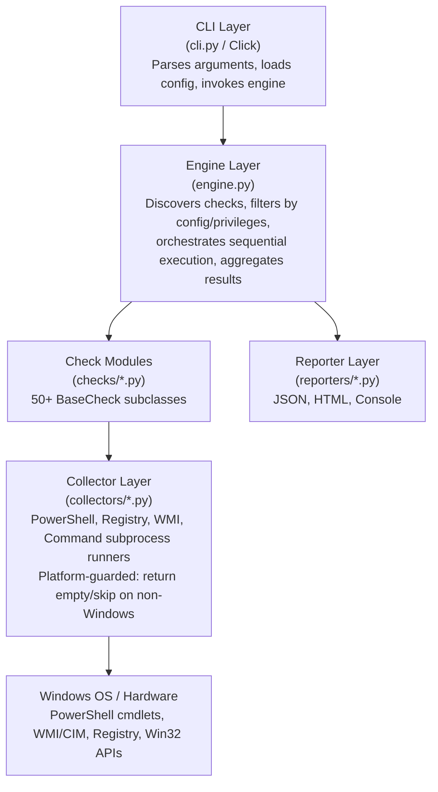
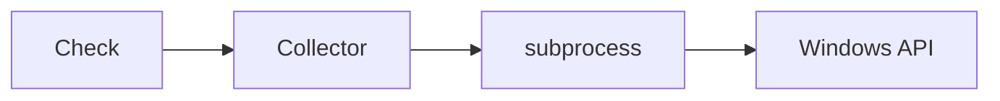
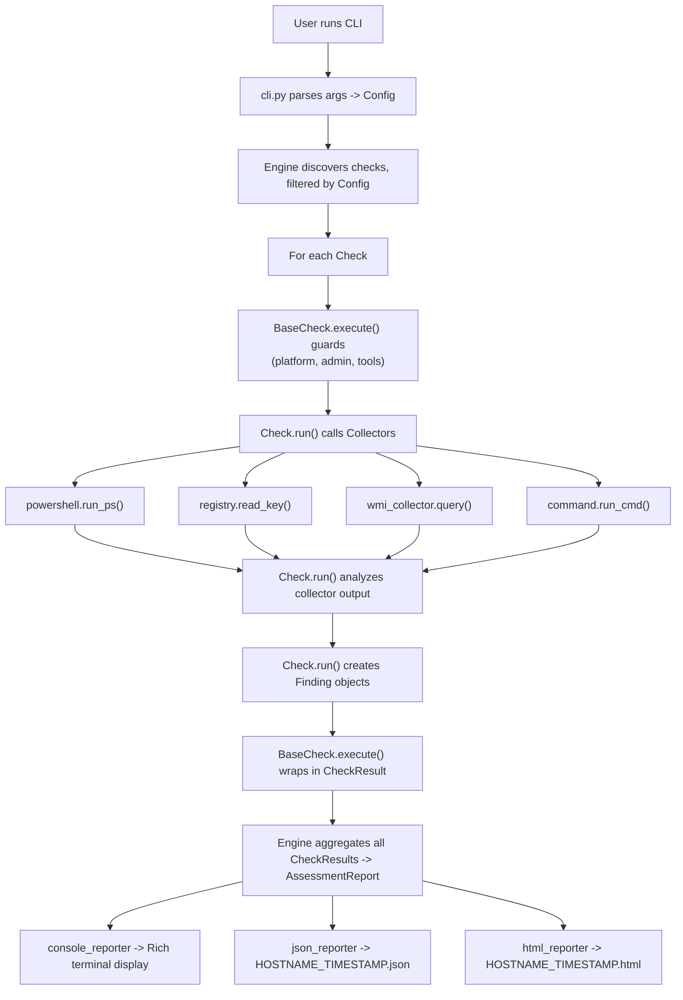

# Vitia Invenire - Architecture Document

## 1. Overview

Vitia Invenire is a modular, plugin-based security assessment tool that audits Windows 11 systems for supply chain compromise. It collects hardware, firmware, software, and configuration data, analyzes it against known-good baselines and threat indicators, and produces structured reports with severity-scored findings.

## 2. High-Level Architecture



## 3. Design Decisions

### 3.1 Plugin Discovery via ABC + pkgutil

Check modules are discovered automatically at runtime. Any Python class that:
1. Lives in a module under `vitia_invenire.checks`
2. Subclasses `BaseCheck`
3. Has a non-empty `CHECK_ID`

...is automatically discovered and registered by the engine. No manual registration, no decorator, no entry point config. Adding a new check = creating a new file with a BaseCheck subclass.

**Trade-off:** Slightly slower startup (imports all check modules) but zero friction for adding checks. For 50+ checks this is negligible.

### 3.2 Sequential Check Execution

Checks run sequentially, not in parallel. Reasons:
- Some checks may temporarily modify system state (mounting ESP, stopping services for inspection)
- PowerShell and WMI connections have overhead that doesn't parallelize well on Windows
- Sequential execution makes progress reporting and error handling straightforward
- The bottleneck is I/O-bound Windows API calls, not CPU

### 3.3 Collector Abstraction Layer

Checks do not call `subprocess.run()` directly. They use typed collectors:



Benefits:
- **Testability:** Collectors can be patched in tests without patching subprocess
- **Platform guards:** Each collector has `platform_available()` -- returns False on Linux
- **Error handling:** Centralized timeout, encoding, and error parsing
- **Consistency:** All PowerShell output is parsed as JSON, all registry reads return typed values

### 3.4 Pydantic Models for Everything

All data flows through Pydantic v2 models:
- `Finding` -- individual security finding with severity, evidence, recommendation
- `CheckResult` -- outcome of one check (pass/fail/error/skip + findings)
- `HardwareFingerprint` / `HardwareComponent` -- hardware inventory data
- `BinaryAnalysis` -- per-binary analysis results
- `AssessmentReport` -- top-level report containing everything

Benefits:
- Free JSON serialization/deserialization
- Validation at construction time
- Schema generation for documentation
- Type safety throughout the codebase

### 3.5 Cross-Platform Development

The tool targets Windows 11 exclusively but is developed on Linux. This is handled at three layers:

1. **Platform module (`platform.py`):** `is_windows()`, `is_admin()`, `has_tool()` utility functions
2. **Collectors:** Each collector's methods check `is_windows()` and return empty/error results on Linux
3. **BaseCheck.execute():** Template method checks platform requirements before calling `run()`
4. **Tests:** Platform-conditional skipping via `@pytest.mark.skipif`

On Linux, `vitia-invenire scan` runs successfully -- all checks report status "skipped" with reason "Not running on Windows". This validates the framework, CLI, engine, and reporters without requiring a Windows system.

### 3.6 No pywin32 Dependency

Windows API access is via subprocess calls to PowerShell and built-in Windows tools (bcdedit, reagentc, sfc, etc.) rather than the pywin32 package. Reasons:
- pywin32 cannot be installed on Linux (blocks development)
- PowerShell provides access to everything needed (WMI, registry, certificates, Secure Boot)
- PowerShell output as JSON is easy to parse
- No binary extension modules to compile

### 3.7 YAML Configuration

Check behavior is configurable via YAML:

```yaml
categories:
  enabled:
    - all  # or list specific categories
checks:
  disabled: []  # Check IDs to skip
  CERT-001:
    known_good_certs_path: "data/known_good_certs.json"
  HASH-001:
    nsrl_db_path: null  # User must provide
    vt_api_key: null    # Optional
    vt_rate_limit: 4    # Requests per minute
severity:
  minimum: INFO
output:
  formats:
    - console
    - json
  directory: ./reports
```

## 4. Module Structure

### 4.1 models.py

Core data models shared across the entire application.

```
Severity (Enum)     -- CRITICAL, HIGH, MEDIUM, LOW, INFO
Category (Enum)     -- Hardware, Firmware, Binary Integrity, ...
Finding             -- Individual security finding
CheckResult         -- Result of one check execution
HardwareComponent   -- Single hardware component
HardwareFingerprint -- Complete hardware inventory
BinaryAnalysis      -- PE analysis results for one binary
AssessmentReport    -- Top-level report model
```

`Finding` is the atomic unit of output. Every check produces zero or more Findings. Each Finding has:
- A severity level driving prioritization
- An affected_item identifying what was found (registry key, file path, certificate, etc.)
- Evidence containing raw proof (command output, hash values, configuration snippets)
- A recommendation for remediation
- Optional CVSS vector and score for vulnerability-class findings
- Optional references (CVE IDs, blog posts, MITRE ATT&CK IDs)

### 4.2 platform.py

Platform detection and privilege utilities:

```python
is_windows() -> bool        # sys.platform == "win32"
is_admin() -> bool          # ctypes.windll.shell32.IsUserAnAdmin() on Windows
has_tool(name) -> bool      # shutil.which() for external tools
get_os_version() -> str     # Platform-specific OS version string
get_hostname() -> str       # socket.gethostname()
```

All functions are safe to call on any OS and return sensible defaults (False, "Unknown") on non-Windows.

### 4.3 config.py

YAML configuration loader with defaults:

```python
class Config:
    enabled_categories: list[str]
    disabled_checks: list[str]
    check_configs: dict[str, dict]
    minimum_severity: Severity
    output_formats: list[str]
    output_directory: str
    skip_admin_checks: bool
    verbose: bool
```

Loads from YAML file, falls back to built-in defaults in `data/check_config.yaml`. CLI flags override config file values.

### 4.4 Collectors

#### powershell.py

```python
class PowerShellResult:
    success: bool
    output: str
    json_output: Any | None  # Parsed if command used ConvertTo-Json
    error: str | None
    return_code: int

def run_ps(command: str, timeout: int = 60, as_json: bool = True) -> PowerShellResult
```

- Invokes `powershell.exe -NoProfile -NonInteractive -Command ...`
- Optionally wraps command in `... | ConvertTo-Json -Depth 10`
- Handles encoding (UTF-8 BOM from PowerShell), timeouts, and errors
- Returns structured result with parsed JSON when available

#### registry.py

```python
class RegistryValue:
    name: str
    data: Any
    type: int  # REG_SZ, REG_DWORD, etc.

def read_key(hive: int, path: str, wow64_32: bool = False) -> list[RegistryValue]
def read_value(hive: int, path: str, name: str) -> RegistryValue | None
def enumerate_subkeys(hive: int, path: str) -> list[str]
```

- Wraps `winreg` standard library module
- Handles WOW64 redirection (32-bit vs 64-bit registry views)
- Returns empty lists / None on non-Windows or access denied

#### wmi_collector.py

```python
def query(wmi_class: str, properties: list[str] | None = None,
          namespace: str = "root\\cimv2", where: str | None = None) -> list[dict]
```

- Executes WMI queries via PowerShell `Get-CimInstance` (not the wmi Python module)
- Returns list of dicts with requested properties
- Supports custom namespaces (e.g., `root\cimv2\Security\MicrosoftTpm`)
- Handles timeout, access denied, and namespace-not-found errors

#### command.py

```python
class CommandResult:
    success: bool
    stdout: str
    stderr: str
    return_code: int

def run_cmd(args: list[str], timeout: int = 60, shell: bool = False) -> CommandResult
```

- Generic subprocess runner for non-PowerShell tools (nmap, bcdedit, sfc, etc.)
- Returns structured result
- Handles timeouts and encoding

### 4.5 checks/base.py -- The Check Lifecycle

```python
class BaseCheck(ABC):
    CHECK_ID: str          # e.g., "CERT-001"
    NAME: str              # Human-readable name
    DESCRIPTION: str       # What this check does
    CATEGORY: Category     # Classification
    REQUIRES_ADMIN: bool = False
    REQUIRES_TOOLS: list[str] = []  # External tool binary names

    def execute(self) -> CheckResult:
        """Template method implementing the check lifecycle."""
```

The `execute()` template method enforces a consistent lifecycle:

```
1. Platform Check
   -- Not Windows? -> return CheckResult(status="skipped", error="Not running on Windows")

2. Privilege Check (if REQUIRES_ADMIN)
   -- Not admin? -> return CheckResult(status="skipped", error="Requires admin privileges")

3. Tool Check (if REQUIRES_TOOLS)
   -- Tool missing? -> return CheckResult(status="skipped", error="Requires: nmap")

4. Execute Check
   -- start_time = time.time()
   -- findings = self.run()      <- Abstract method, implemented by each check
   -- duration = time.time() - start_time
   -- return CheckResult(
           status="passed" if no findings else "failed",
           findings=findings,
           duration_seconds=duration
       )

5. Error Handling
   -- Exception? -> return CheckResult(status="error", error=str(exception))
```

Individual checks only implement `run() -> list[Finding]`. All boilerplate (privilege checks, timing, error handling) is in the base class.

### 4.6 engine.py -- Check Discovery and Orchestration

```python
class Engine:
    def __init__(self, config: Config):
        self.config = config
        self.checks = self._discover_checks()

    def _discover_checks(self) -> list[BaseCheck]:
        """Walk vitia_invenire.checks package, find all BaseCheck subclasses."""

    def run(self) -> AssessmentReport:
        """Execute all enabled checks sequentially, return report."""
```

Discovery process:
1. `pkgutil.walk_packages(checks.__path__)` to find all modules
2. `importlib.import_module()` each module
3. Inspect module for BaseCheck subclasses (via `issubclass`)
4. Filter by config (enabled categories, disabled check IDs)
5. Filter by `skip_admin_checks` flag
6. Sort by category for organized execution
7. Instantiate each check class

Execution:
1. Create Rich progress bar
2. For each check: update progress, call `check.execute()`, collect CheckResult
3. Build AssessmentReport with all results and summary counts

### 4.7 Reporters

All reporters implement a simple interface:

```python
class BaseReporter:
    def generate(self, report: AssessmentReport, output_dir: str) -> str:
        """Generate report, return output file path."""
```

#### json_reporter.py
- Serializes AssessmentReport to JSON via Pydantic's `.model_dump_json(indent=2)`
- Writes to `{output_dir}/{hostname}_{timestamp}.json`

#### console_reporter.py
- Uses Rich library for formatted terminal output
- Severity-colored finding summaries
- Summary table with counts per severity and category
- Shows skipped checks with reasons

#### html_reporter.py
- Renders `templates/report.html.j2` via Jinja2
- Self-contained HTML (inline CSS, no external dependencies)
- Executive summary with severity pie chart (CSS-only)
- Collapsible finding details with evidence
- Filterable by severity and category
- Print-friendly CSS media queries

## 5. Data Flow



## 6. Check Categories and Execution Order

Checks execute in category order for logical grouping in output:

1. **Hardware** -- Inventory and fingerprinting (baseline data), subsystem firmware audit
2. **Firmware** -- BIOS, UEFI, Secure Boot, TPM, Boot Guard, ME, component firmware (NIC, GPU, audio, WiFi, BT, webcam, etc.)
3. **Binary Integrity** -- Hashing, signatures, PE analysis, NSRL/VT
4. **OEM Pre-Installation** -- WPBT, OEM activation, recovery, OOBE, telemetry
5. **Certificates** -- Root CA trust store audit
6. **Persistence** -- WMI, scheduled tasks, registry autostart, COM, BITS, PS profiles
7. **Drivers** -- Driver signature verification, LOLDrivers
8. **Services** -- Service binary validation, unquoted paths
9. **Accounts** -- User accounts, hidden accounts, admin membership
10. **Network** -- Connections, network process audit (listeners, raw sockets, pcap, port knockers), firewall, hosts, DNS, proxy, WiFi, VPN, IPv6, WPAD
11. **Configuration** -- Boot config, event logs, VSS, DPAPI, WER, browser, spooler
12. **Remote Access** -- SSH, RDP, Intel AMT
13. **Defense Evasion** -- ETW tampering, named pipes
14. **Hardening** -- Defender status, file integrity, HardeningKitty, CIS-CAT
15. **Malware** -- (reserved for future checks, currently covered by binary integrity)

## 7. Finding Severity Assignment

Each check follows consistent severity rules:

| Condition | Severity | Rationale |
|-----------|----------|-----------|
| Confirmed compromise indicator | CRITICAL | WMI subscription, rogue CA, C2 named pipe |
| Trivially exploitable backdoor | CRITICAL | AMT default creds, pre-planted SSH keys |
| Strong anomaly, likely malicious | HIGH | Unsigned driver, unknown PCI device, packed system binary |
| Missing security control | MEDIUM | Secure Boot disabled, small event logs |
| Informational with slight risk | LOW | Outdated firmware, non-default config |
| Baseline data, no action needed | INFO | Hardware inventory, software list |

## 8. Error Handling Strategy

### Collector Level
- Timeout: returns error result with timeout message
- Access denied: returns error result (check will report "skipped" or "error")
- Encoding: PowerShell output decoded as UTF-8 with error replacement
- Missing tool: `platform_available()` returns False, check skips

### Check Level
- BaseCheck.execute() wraps `run()` in try/except
- Any unhandled exception -> CheckResult with status="error" and error_message
- Individual Finding creation failures are caught per-finding (one bad finding doesn't abort the check)

### Engine Level
- Check execution failures are logged and collected (never abort the full scan)
- Engine always produces an AssessmentReport, even if all checks error

### CLI Level
- Catches all exceptions, prints user-friendly error
- Non-zero exit code if any CRITICAL findings detected

## 9. Configuration Schema

```yaml
# check_config.yaml -- Default configuration
categories:
  enabled:
    - all                    # Run all categories; or list specific ones

checks:
  disabled: []               # Check IDs to skip entirely

  # Per-check configuration
  CERT-001:
    known_good_certs_path: null   # Uses built-in data/known_good_certs.json
    known_bad_certs_path: null    # Uses built-in data/known_bad_certs.json

  HASH-001:
    nsrl_db_path: null            # Path to NSRL SQLite DB (user-provided)
    vt_api_key: null              # VirusTotal API key (optional)
    vt_rate_limit: 4              # Max VT requests per minute (free tier)
    vt_daily_limit: 500           # Max VT requests per day (free tier)

  BIN-001:
    scan_paths:
      - "C:\\Windows\\System32"
      - "C:\\Windows\\SysWOW64"
      - "C:\\Windows\\System32\\drivers"
      - "C:\\Program Files"
      - "C:\\Program Files (x86)"
    extensions:
      - ".exe"
      - ".dll"
      - ".sys"
      - ".ocx"
    max_threads: 4

  NMAP-001:
    scan_args: "-sV -sC --script smb-vuln-ms17-010,smb-security-mode"
    target: "127.0.0.1"

  NESSUS-001:
    host: "localhost"
    port: 8834
    access_key: null
    secret_key: null
    policy_name: "Advanced Scan"
    scan_timeout: 3600

  CIS-001:
    ciscat_path: null             # Path to CIS-CAT Assessor CLI
    benchmark: "CIS_Microsoft_Windows_11_Enterprise"

  HK-001:
    finding_list: "finding_list_cis_microsoft_windows_11_enterprise_22h2_machine"

severity:
  minimum: INFO                  # Minimum severity to include in reports

output:
  formats:
    - console
    - json
  directory: ./reports
```

## 10. Reference Data Files

### known_good_certs.json
Microsoft Trusted Root Program thumbprints. Source: Microsoft's published list of trusted root certificates. Updated periodically. Format: array of `{thumbprint, subject, issuer, not_after}`.

### known_bad_certs.json
Known-malicious certificate thumbprints. Includes Superfish, eDellRoot, Komodia, PrivDog, and other documented rogue CAs. Format: array of `{thumbprint, name, description, severity, reference}`.

### suspicious_ports.json
TCP ports associated with known C2 frameworks and backdoors. Format: array of `{port, name, description}`. Includes Metasploit defaults (4444, 4445), Cobalt Strike (50050), common backdoor ports (31337, 1337), etc.

### suspicious_imports.json
PE import function names indicating potentially malicious behavior. Organized by technique (process injection, hooking, anti-analysis, credential access).

### suspicious_pipes.json
Named pipe patterns associated with C2 frameworks. Includes Cobalt Strike (postex_, status_, mojo), Metasploit (meterpreter), PsExec (psexesvc), and others.

### lol_drivers.json
Living-Off-the-Land vulnerable driver hashes from the LOLDrivers project. Drivers with known vulnerabilities that can be exploited for kernel-level access.

### known_pci_vendors.json
Legitimate PCI vendor IDs (Intel, AMD, NVIDIA, Realtek, Broadcom, etc.) for whitelisting during PCI device audit.

### suspicious_listeners.json
Process names and port patterns associated with covert network listeners, packet capture tools, and port knockers. Includes well-known offensive tools (ncat, socat, netcat variants) and packet capture libraries (npcap, winpcap, raw socket indicators). Format: array of `{process_name, description, severity}`.

## 11. Subsystem Firmware Audit (FW-SUB-001) Design

Every discrete component in a laptop that has its own firmware or embedded processor is a potential supply chain trojan vector. The FW-SUB-001 check provides deep enumeration of these subsystems beyond the basic HW-001 inventory.

### Targeted Subsystems

| Subsystem | Firmware Location | Attack Surface | Collection Method |
|-----------|------------------|----------------|-------------------|
| Audio Codec (Realtek, Cirrus Logic) | I2C/SPI flash on codec chip | Malicious DSP firmware could enable covert microphone recording | Win32_PnPSignedDriver filtered by AudioEndpoint class |
| WiFi Module (Intel AX, Qualcomm, MediaTek) | On-module flash | Rogue firmware could exfiltrate data over WiFi, create hidden APs | Win32_PnPSignedDriver Net class + netsh wlan show drivers |
| Bluetooth Module | Shared with WiFi or separate | Rogue firmware could enable covert BT data exfil or HID injection | Win32_PnPEntity BTH filter + driver version |
| NIC (Intel I219, Realtek) | EEPROM on NIC | Rogue NIC firmware could mirror traffic or inject packets | Win32_NetworkAdapter + Win32_PnPSignedDriver |
| GPU (NVIDIA, AMD, Intel) | VBIOS in SPI flash or option ROM | Malicious VBIOS can execute code at ring 0 during boot | Win32_VideoController.DriverVersion + nvidia-smi / AMD tools |
| NVMe Controller (Samsung, SK Hynix, WD) | Controller flash | Rogue firmware could hide data, tamper with reads/writes | Win32_DiskDrive.FirmwareRevision + StorageWMI |
| Thunderbolt Controller (Intel, Apple) | Controller flash | DMA attacks, firmware can bridge PCIe without IOMMU | Win32_PnPEntity Thunderbolt filter + registry |
| Webcam (vendor-specific ISP) | ISP flash on camera module | Covert recording without LED indicator | Win32_PnPEntity Camera class filter |
| Fingerprint Reader (Synaptics, Goodix, ELAN) | Sensor flash | Biometric data theft, authentication bypass | Win32_PnPEntity Biometric filter |
| TPM (Infineon, STMicro, Intel fTPM) | Discrete chip or firmware TPM | Key extraction, attestation forgery | Win32_Tpm in SecurityMicrosoftTpm namespace |
| Intel CSME/ME | SPI flash region | Full platform compromise, persistent below OS | MEInfoWin + registry HKLM\SOFTWARE\Intel |
| USB Controllers (vendor-specific) | Controller ROM | USB protocol-level attacks, HID injection | Win32_USBController + Win32_PnPSignedDriver |
| SD Card Reader (Realtek, Genesys) | Controller flash | Storage-level attacks similar to NVMe | Win32_PnPEntity SD host filter |
| WWAN/LTE Modem (Sierra, Fibocom, Quectel) | Modem baseband flash | Covert cellular data exfil, SMS C2 channel | Win32_PnPEntity Modem class filter |
| Embedded Controller (vendor-specific) | EC flash | Power management abuse, keyboard interception | Win32_BIOS EC version fields |

### Analysis Strategy

For each subsystem, the check:
1. Enumerates the device via WMI/PnP and records manufacturer, model, PnP device ID
2. Extracts firmware/driver version from Win32_PnPSignedDriver or device-specific APIs
3. Records the driver signer and verifies the driver signature
4. Flags firmware versions that do not match vendor-published current versions (if baseline data available)
5. Flags devices with unsigned or self-signed drivers = HIGH
6. Flags unexpected device manufacturers for the laptop model = HIGH
7. Reports full subsystem manifest for cross-device comparison within a batch

## 12. Network Process Audit (NET-PROC-001) Design

This check detects processes that interact with the network or network card beyond normal application-level TCP/UDP connections.

### Detection Targets

| Behavior | Detection Method | Severity |
|----------|-----------------|----------|
| Listening TCP/UDP sockets | psutil connections with LISTEN state, correlate to owning process | Varies by process/port |
| Raw socket usage | Enumerate processes with AF_INET/SOCK_RAW via PowerShell Get-NetTCPConnection + Get-NetUDPEndpoint and psutil | HIGH on new device |
| Promiscuous mode / packet capture | Check NIC promiscuous mode flag via PowerShell, detect npcap/winpcap driver loaded, enumerate processes loading wpcap.dll or Packet.dll | HIGH on new device |
| Port knocker processes | Detect processes with multiple sequential short-lived connections to varied ports (behavioral via connection history) | HIGH |
| Processes bound to 0.0.0.0 or :: | psutil listening sockets bound to all interfaces (not localhost) | MEDIUM for unexpected processes |
| NDIS filter drivers | Enumerate NDIS filter drivers via Get-NetAdapterBinding, flag non-Microsoft filters | HIGH for unknown filters |
| DNS listeners | Detect processes listening on port 53 (potential DNS tunneling relay) | CRITICAL |
| Unexpected ICMP handlers | Detect processes with ICMP raw sockets (ping tunnel / covert channel) | HIGH |

### Baseline Expectations for a New Device

On a clean Windows 11 laptop, the only expected network listeners are:
- svchost.exe (various Windows services)
- System (kernel-level listeners like SMB)
- lsass.exe (Kerberos, if domain-joined)
- spoolsv.exe (if print spooler enabled)

Any other process with a listening socket or raw network access on a brand-new device is suspicious and warrants investigation.

## 13. Testing Strategy

### Unit Tests (Linux)
- Model creation, validation, serialization/deserialization
- Engine check discovery (with test BaseCheck subclasses defined in test files)
- Config loading (YAML parsing, defaults, overrides)
- Reporter output format validation (valid JSON, valid HTML)
- Collector error handling (timeouts, platform guards)

### Platform-Conditional Tests
- Tests requiring Windows APIs use `@pytest.mark.skipif(not is_windows())`
- On Linux CI: these tests skip automatically
- On Windows: full integration test suite

### Check Logic Tests
- Patched collector return values to test check analysis logic in isolation
- Verify correct Findings are generated for known-bad inputs
- Verify no false positives for known-good inputs

### Integration Tests (Windows only)
- End-to-end scan with real system data
- Verify all checks execute without errors
- Validate report output files

## 14. Security Considerations

### Tool Security
- No network access by default (all checks are local)
- Optional network access only for: VirusTotal API, Nessus API, Nmap scans
- API keys stored in config file (user's responsibility to protect)
- No data exfiltration -- all output is local files
- Runs with user's existing privileges (no privilege escalation)

### Operational Security
- Tool should be run from a trusted USB drive or network share, not pre-installed
- Reports may contain sensitive system data (hashes, config, accounts)
- Reports should be stored securely and transmitted encrypted
- NSRL database is read-only, user-provided

### False Positives
- Known-good baselines reduce false positives (NSRL, Microsoft trusted roots)
- Each Finding has a `false_positive` field for analyst marking
- Per-check configuration allows customizing thresholds and whitelists
